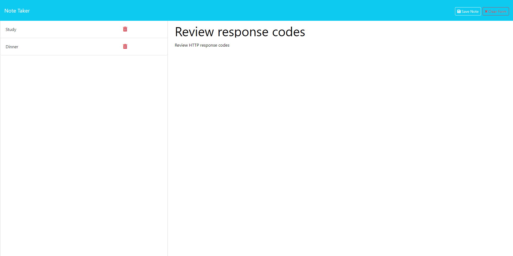

# Note Taker Application

## Description

The Note Taker application allows end users to write notes to keep track of their most important daily tasks.  The application provides space to enter new notes, save notes, retrieve previously created notes, and delete notes when items are completed.  The application connects with different endpoints defined using `express.js` on the back-end to facilitate connections and complete the required tasks.  Each note is given a universally unique identifier (uuid) using the `uuid`  module.  The id is used to retrieve previously created notes and either delete or display their contents.

## Table of Contents 

- [Installation](#installation)  
- [Usage](#usage)  
- [License](#license)
- [Questions](#questions)  
      
    
## Installation

No installation is required to use the application.  The Note Taker application has been deployed to Heroku and can be accessed at the following URL: 

If a developer would like to access the underlying code utilized to create the application, it can be installed by cloning the repository to the local machine.  Please note, `Node.js` is required in order to run this application and will need to be installed before attempting to use the code.  The package dependencies, are included within the package.json file and can be installed through a simple `npm i` command once the repository has been successfully cloned on the local computer.  The `uuid` and `express` modules are required for this application to run correctly and must be installed prior to initializing the express.js server.

## Usage

The application is initialized by running the `node server.js` command through the terminal.  When the `server.js` file is called, it will start the express.js module and provide input in the console to confirm the application is listening on the port specified.  The application is currently configured to use port 8081, but this can easily be updated using the `PORT` variable defined within the server.js file.  The application can be accessed through a web browser using the address: localhost:8081.  If a port other than 8081 is specified, this location should be replaced with the updated port number.

When accessed, the application provides the home page through a GET request.  The main `index.html` file is provided in the response from the server.  Navigating to any endpoint other than the root or /notes route should provide the main index.html file and redirect users back to the initial landing page.  Clicking the "Get Started" button on the homepage will make a GET request to the `/notes` endpoint, and the server will respond with the `notes.html` file.  This file provides the interface for the note-taking capabilities of the application.

When the notes.html file initially loads, the Note Title and Note Text sections should be empty and ready for a new note.  Clicking the placeholder text in the corresponding fields will provide space to create a new note.  When text is entered into the text section, the save button will display in the pages header next to the add button.  Clicking the save button triggers a `POST` request to the `/api/notes` endpoint to write the contents of the text fields to the database.  The POST request triggers the endpoint to read the current contents of the database, capture the body of the content from the request, and push the new object into the existing array stored in the database with a uuid specific to that note.

Clicking the title of an existing note in the left-hand menu will display the text and title of the information stored in the database.  The note will be displayed in the main note taking section after it is clicked.

To clear the display, the add button in the upper right-hand corner of the window can be clicked.  A new note can then be added.

## License

This application is covered under the license linked below.  For further information regarding the license and its terms, please consult the official licensing documentation using the provided link.

[License: MIT](https://opensource.org/licenses/MIT)

## Contributions

No additional contributions from other developers were made to this project.

## Questions

If you have any questions, please feel free to contact me using the information provided below:  
  
GitHub: [chilejay7](https://github.com/chilejay7?tab=repositories)  
Email: codyburk7@gmail.com
